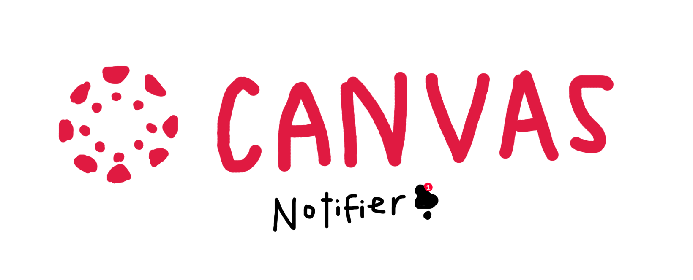

# About

Canvas Notifier is a Python script that texts you as the assignment gets closer if you haven't submitted.  


# Tragic Backstory
I had an assignment that I was about to do and then forgot until 10 minutes before.  

**My live reaction 10 minutes before:**  


# Credentials Setup

First, you'll need to set up credentials stuff (for texting and Canvas API).  

I set it up with multiple envs (there's probably a better way to do it) but you could also alter  
the variables inside the code.

### Gmail Texting Setup
**Follow [this guide](https://support.google.com/accounts/answer/185833?p=InvalidSecondFactor&visit_id=637700239874464736-1954441174&rd=1) to get your credentials for texting.**   


#### ENV Method:
add this .env to ``src/util``:
```
EMAIL=INSERT_YOUR_EMAIL 
PASSWORD=INSERT_YOUR_PASSWORD
PHONE_NUMBER=PHONE_NUMBER_TO_SEND_ALERTS_TO
```  

#### Edit Code Variables Method:
edit these variables found in ``src/util/sms.py``:
```python
EMAIL = 'PUT YOUR EMAIL HERE'  # email to send via
PASSWORD = 'PUT YOUR PASSWORD HERE'  # special auth password for email above
PHONE_NUMBER = 'PUT YOUR PHONE NUMBER HERE'  # phone number to send texts to
```

### Canvas API Setup
**Follow [this guide](https://community.canvaslms.com/t5/Admin-Guide/How-do-I-add-a-developer-API-key-for-an-account/ta-p/259) to get your developer key**  

#### ENV Method:
add this .env in the scope of ``canvas.py``:
```
CANVAS_API_TOKEN=INSERT_YOUR_TOKEN
```

#### Edit Code Variable Method:
edit this variable in ``canvas.py``:
```python
CANVAS_API_TOKEN = 'INSERT YOUR TOKEN HERE'  # Your Canvas API token
```

## Hosting
I used a cron job on an [ec2 instance](https://www.techtarget.com/searchaws/definition/Amazon-EC2-instances) that just checks Canvas every minute.  

**[Get 1 year free of AWS](https://aws.amazon.com/free/?all-free-tier.sort-by=item.additionalFields.SortRank&all-free-tier.sort-order=asc&awsf.Free%20Tier%20Types=*all&awsf.Free%20Tier%20Categories=*all)** (not sponsored)  

 
**The following commands are only UNIX based machines (sorry windows users)**  

**1.**  ``cd`` into /src

```bash
cd canvas-notifier/src/
```

**2.** adjust permissions of python file with ``chmod``

```bash
chmod +x main.py
```

**3.** edit crontab
```bash
crontab -e
```

**4.** put this in your crontab thing (with respective Python and main.py paths)
```
* * * * * /usr/bin/python3 /home/ec2-user/canvas-notifier/src/main.py
```

**5.** enjoy!

# TODO
- [X] Make it work
- [ ] Refactor (lol)
- [ ] Fix some assignment checking bugs
- [ ] Finish Canvas refresh token feature (for more security)

## What I learned:  
- using cronjobs 
- making a free ec2 instance (thanks bezos)
- building a simple project with Python
- you can text for free on gmail servers
- making a decent readme

# FAQ:
**Q: Why AWS?**    
A: Beacuse it was free (thanks bezos)

**Q: Is this practical?**  
A: no

**Q: Does this use AI?**  
A: unfortunately, no.
